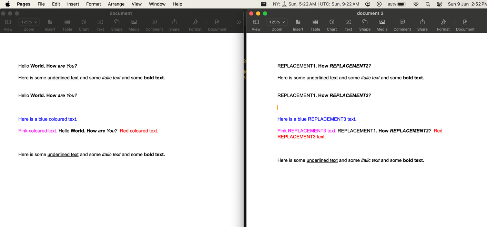

# edit-office-files

search and replace text strings in docx, pptx, xlsx files.

Functionality same as [aspose app](https://products.aspose.app/words/replace/docx#)

## Current Features:

1. Efficient search and replace operations within DOCX files.

## Upcoming Features:

1. Support for searching and replacing text in PPTX and XLSX files.
2. Advanced search options (e.g., regular expressions, case-sensitive search).

## Here is what you can achieve:

**step1:**
```shell
npm i edit-office-files
```

**step2:**
```js

import {SearchAndReplace} from 'edit-office-files';

async function main() {
  const searchTexts = ['Hello World', 'are You', 'coloured'];
  const replacementTexts = ['REPLACEMENT1', 'REPLACEMENT2', 'REPLACEMENT3'];
  const reader = new SearchAndReplace('assets/document.docx', searchTexts, replacementTexts, 'updated.docx');
  await reader.process();
}

main();
```


